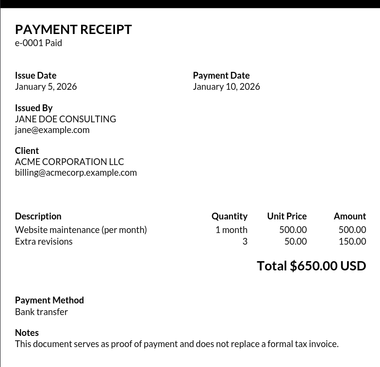

# getor

`getor` turns a `.nera` file into a PDF receipt. That's the entire tool: one command, one input file, one output file.

```sh
getor path/to/receipt.nera
```

This produces `path/to/receipt.pdf` — same name, same directory, `.nera` swapped for `.pdf`.

## Why this exists

This is for freelance/small-scale invoicing that doesn't need a database, a server, an app, or any real infrastructure — just a couple of directories and hand-written text files. The workflow it's built around looks like:

```
freelancing/
  client-a/
    2026-08-29-e-AA01.nera
    2026-08-29-e-AA01.pdf
  client-b/
    2026-07-14-e-AA02.nera
    2026-07-14-e-AA02.pdf
```

Each `.nera` file is a plain-text record of one transaction. Running `getor` on it produces the PDF you actually send. Git gives you history and diffing for free; the filesystem gives you organization; nothing needs to run in the background.

`getor` is built on [`nera`](https://github.com/yarso-su/nera), a small library for parsing positional, line-oriented text files. If you want to understand the underlying file format in general — not just how `getor` uses it — that's the place to look.

## The `.nera` file `getor` expects

A `.nera` file is a sequence of **entries**, separated by blank lines. `nera` parses each entry into one of four shapes, based on how many labels and how many rows of values it has:

- **Literal** — one label, one value.
- **LiteralGroup** — several labels on one line, one row of values matching them.
- **LiteralGroupCollection** — several labels, followed by *multiple* rows of values (a table).

`getor` requires exactly **eight entries, in this order, each of a specific shape**. If a file is a valid `.nera` file but doesn't provide these eight entries in this shape and order, `getor` will not be able to fill in the receipt.

Here's a generic version of a real receipt, annotated entry by entry:

```nera
RECEIPT TITLE
some-id status

Label A, Label B
value a, value b

Label C, Label D
value c, value d

Label E, Label F
value e, value f

Label G, Label H, Label I, Label J
item one, qty, unit price, amount
item two, qty, unit price, amount

Label K
value k

Label L
value l

Label M
some longer text that can span as much as needed
```

| # | Entry (shape)              | Role                                                             |
|---|-----------------------------|-------------------------------------------------------------------|
| 1 | Literal                     | Document title / receipt number and status                       |
| 2 | LiteralGroup (2 fields)     | Issue date / payment date                                         |
| 3 | LiteralGroup (2 fields)     | Issuer name / issuer email                                        |
| 4 | LiteralGroup (2 fields)     | Client name / client email                                        |
| 5 | LiteralGroupCollection      | Line items — description, quantity, unit price, amount, one row per item |
| 6 | Literal                     | Total                                                              |
| 7 | Literal                     | Payment method                                                    |
| 8 | Literal                     | Notes                                                              |

### Labels are yours to change

**The labels (the text before the comma, or before the blank line) are not fixed and changing them is not a bug — it's a feature of `nera` itself.** `nera` never reads or interprets label text; it only cares about an entry's *type* (Literal, LiteralGroup, LiteralGroupCollection) and its *position* in the file. That means you can write your labels in Spanish, English, or anything else, and rename them however you like — `getor` will still fill the right field, because it's reading by position and shape, not by label name.

What you **cannot** change is the entry type and order — entry 5, for example, must always be a `LiteralGroupCollection` (multiple labels, multiple value rows), because that's what `getor` reads as the line-items table. Swap that for a `Literal` or reorder it elsewhere in the file, and `getor` won't know what to do with it.

A real example, filled out:

```nera
PAYMENT RECEIPT
e-0001 Paid

Issue Date, Payment Date
"January 5, 2026", "January 10, 2026"

Issued By, Email
JANE DOE CONSULTING, jane@example.com

Client, Email
ACME CORPORATION LLC, billing@acmecorp.example.com

Description, Quantity, Unit Price, Amount
Website maintenance (per month), 1 month, 500.00, 500.00
Extra revisions, 3, 50.00, 150.00

Total
"$650.00 USD"

Payment Method
Bank transfer

Notes
This document serves as proof of payment and does not replace a formal tax invoice.
```

(Quoting a value in `"double quotes"` is a `nera` feature for including a literal comma inside a value — see the `nera` README for details.)

**Result:**



## Everything is static text

`getor` does not parse, validate, or compute anything numeric. Quantities, unit prices, amounts, and totals are placed on the PDF exactly as written in the `.nera` file — as strings. There is no arithmetic, no currency formatting, no date parsing. If a total doesn't match the sum of the line items, `getor` will not catch it; you're responsible for writing correct values by hand.

## Dynamic layout

The generated PDF's height is not fixed — it grows or shrinks based on the number of line items in the collection entry and the length of the notes text in the final entry, so a receipt with two line items and a short note produces a shorter page than one with fifteen line items and a long note.

## Recommended workflow

Since every field has to be typed by hand and most of a receipt (your name, your email, boilerplate notes) doesn't change between clients, it's worth keeping a template `.nera` file around rather than writing one from scratch each time. [`lates`](https://github.com/yarso-su/lates) is a small tool for managing exactly this kind of file template — copy a template, fill in the client-specific fields, run `getor` on it.

## Install

```sh
go install github.com/yarso-su/getor@v0.1.0
```

## A note on scope

This is a highly specific format, built around one person's freelance invoicing needs — it won't fit every business's receipt requirements, and it isn't trying to. If it doesn't fit yours, forking it (or writing your own tool against `nera` directly) is the intended path, not a fallback. `nera` was built to be general-purpose; `getor` deliberately isn't.

The code itself is mostly straight-line, imperative PDF-drawing logic (built on `fpdf`) with light documentation — it's a means to an end, not a library meant to be extended. If you're trying to understand the *file format* rather than the PDF-drawing code, [`nera`](https://github.com/yarso-su/nera) is the better place to look.

## License

MIT — see [LICENSE](LICENSE).
